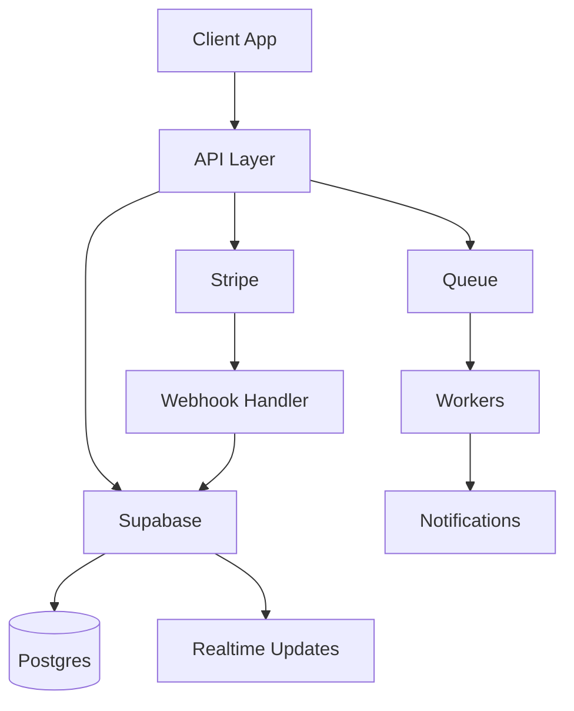

# DK Digital Engineering Playbook

A practical, opinionated system for choosing and using tools across projects (e.g., SKIIP). This document evolves with real usage.

---

# How to Use This

For any project, answer:

1. Auth → which provider?
2. Data → which DB + access pattern?
3. Compute → serverless vs container?
4. Async → queues / workflows?
5. Delivery → CI/CD + hosting?
6. Observability → logs/metrics/traces?
7. AI → where does it add value?

---

# Decision Frameworks

## Auth

* Fast MVP: Supabase Auth / Clerk
* Enterprise / SSO: Auth0 / Keycloak
* Avoid: rolling your own

## Database

* Relational + consistency: PostgreSQL
* Serverless + scale: Neon / PlanetScale
* Flexible schema: MongoDB
* Cache / rate limiting: Redis

## Realtime

* Simple: Supabase Realtime / Pusher
* Custom: WebSockets (Socket.IO)

## Async / Workflows

* Simple jobs: BullMQ
* Complex long-running: Temporal
* Event streaming: Kafka (only when needed)

## Deployment

* Frontend: Vercel
* Fullstack simple: Railway / Render
* Edge heavy: Cloudflare
* Complex infra: AWS

## Observability

* Errors: Sentry
* Metrics: Prometheus + Grafana
* Tracing: OpenTelemetry

## Payments

* Default: Stripe

## AI Layer

* Coding: Codex / Cursor
* Reasoning/docs: Claude
* Agents: Cline / Aider

---

# Core Stack (Recommended Baseline)

* Frontend: React + Next.js
* Backend: Supabase (Postgres + RLS + Edge Functions)
* Hosting: Vercel + Cloudflare
* Payments: Stripe
* Notifications: Resend + Twilio
* CI/CD: GitHub Actions
* Monitoring: Sentry

---

# Tool Profiles (Living Entries)

## Supabase

* Best for: Rapid MVP, Postgres + auth + realtime
* Avoid when: heavy custom backend logic, complex workflows
* Alternatives: Firebase, custom Node backend
* Used in: SKIIP

## Stripe

* Best for: Payments, subscriptions, marketplace flows
* Avoid when: extreme custom financial flows
* Notes: Use webhooks + idempotency

## Vercel

* Best for: Frontend + serverless APIs
* Avoid when: long-running backend jobs

## Cloudflare

* Best for: DNS, CDN, edge functions
* Notes: great performance + security layer

## GitHub Actions

* Best for: CI/CD automation
* Notes: integrate lint, tests, deploy

## Redis

* Best for: caching, rate limiting, queues

## BullMQ

* Best for: background jobs

## Sentry

* Best for: error tracking in production

---

# Patterns (What matters more than tools)

## Server-Authoritative Systems

* All sensitive logic runs server-side
* Client is just a UI layer

## Event-Driven Architecture

* Actions trigger events
* Events trigger jobs (notifications, updates)

## Idempotency

* Every external action (payments, webhooks) must be safe to retry

## Observability First

* Logs, metrics, traces from day 1

---

# SKIIP Reference Architecture

---

# Evaluation Template (Use when adding new tools)

Tool Name:

* Category:
* Best for:
* When to avoid:
* Alternatives:
* Cost model:
* Complexity:
* DK Digital usage:

---

# Notes / Future Additions

* Add comparisons (Supabase vs Firebase vs custom)
* Add cost benchmarks
* Add scaling patterns
* Add AI agent workflows
